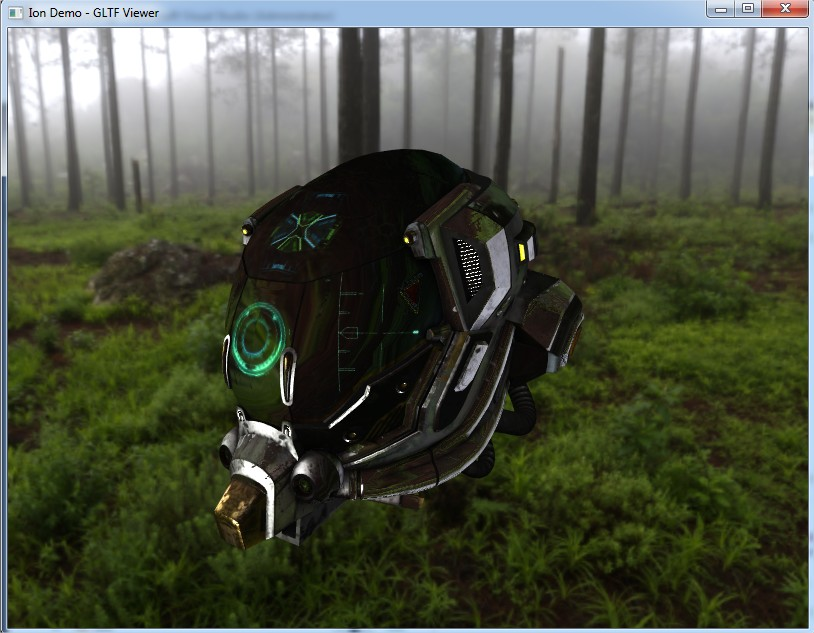
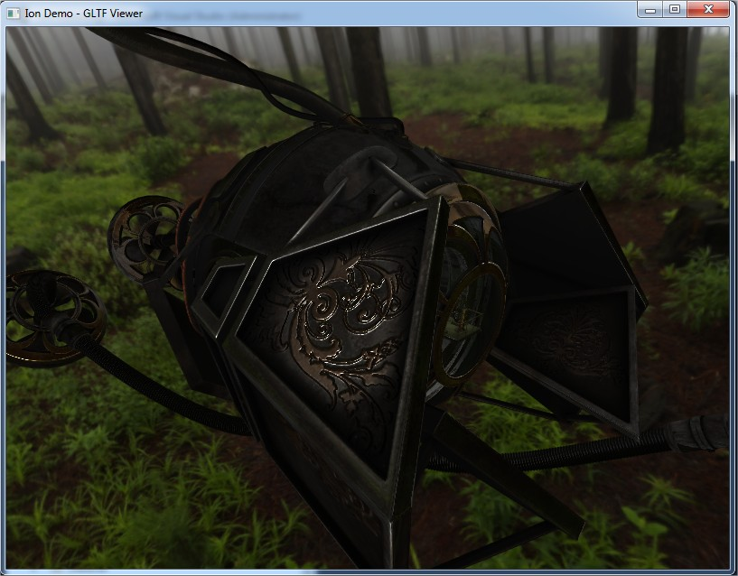

# Ion

Ion is a Vulkan Render Engine, made just to learn something about this new graphic API.
I'm not a render or engine programmer and this work MUST NOT BE USED for any commercial purpose.

> Ion in the Greek Mythology is the illegitimate child of Creüsa, daughter of Erechtheus and wife of Xuthus

## Status

**[X64] WORKING**

I'm not planning to do a x86 version

This is a screenshot about a first test on PBR render, maybe I need a more "brighty" and "shiny" skybox to generate maps from and set some different material parameters.

Using the DamagedHelmet supplied with this demo (for the license raed the end of this file)

Another PBR test (model NOT supplied by this demo, but you can download from https://sketchfab.com)

Another PBR test (model NOT supplied by this demo, but you can download from https://sketchfab.com)
In this case I have exagerate the PBR settings (See controls below)

Instead this screenshot has taken from a NOT PBR model, to test the capabilities of my renderer to swap to the "closest" material if Physical settings are not supplied
(Again this mode is NOT supplied by this demo, but you can download from https://sketchfab.com)

## Controls

At the beginning you have to select the test, from 1 to 5 are generated primitives, 6 is to see the BRDFlut texture in a quad and the 7 is the DamageHelmet PBR test.

The controls in this demo test are:
* Hold left mouse button in order to rotate the object
* Hold right mouse button in order to pan right or left and up or down the object
* Use the mouse wheel to go toward or far away the object
* Press R to auto rotate the model
* Press B to toggle a fancy bounding box
* Press A and S to increase or decrease the scale respectively

Pressing the key L, you can change the control from the model to the light
In this case, toggling the L key you will have:
* Hold left mouse button in order to rotate the light
* Hold right mouse button in order to change the direction of the light from right or left and up or down
* Use the mouse wheel in order to change the direction of the light in forward

To Debug PBR (this works just with the 7th test for now because is the only one using the PBR shader)
You need to have defined ION_PBR_DEBUG (by default is defined)
* Press 1, 2 or 3 to change the active value between esposure, gamma or prefiltered cube mip levels
* Press Q or Z to increment or decrement the selected values

## Important

As I wrote before, this is made to learn something about this API.
I got my inspiration from the following persons and their code
- Dustin Land (https://www.fasterthan.life/) 
	- GitHub: https://github.com/DustinHLand
- Sascha Willems (https://www.saschawillems.de/)
	- GitHub: https://github.com/SaschaWillems

## LICENSE

- Sources:
	- **ION**, the main project, is under GPL-3.0
	- **Eos**, **Nix** and **vkMemoryAllocator** are under Apache-2.0
	- **json.hpp** is under MIT License
	- **stb_image.h** is under MIT License OR Public Domain
	- **stb_image_write.h** is under MIT License OR Public Domain
	- **tiny_gltf.h** is under MIT License

- Assets:
	- **Yokohama3** is under Creative Commons Attribution 3.0 Unported License http://creativecommons.org/licenses/by/3.0/
	- **Damaged Helmet** is under a Creative Commons Attribution-NonCommercial license: https://github.com/KhronosGroup/glTF-Sample-Models/tree/master/2.0/DamagedHelmet

### Almost self inclusive

I tried to reduce external dependencies to the minimum.
All the dependencies are inside DEPENDENCIES folder.
The main dependencies at the moment are the memory allocators for CPU and GPU, made by me (Eos and vkMemoryAllocator)
Other dependencies are single file, like json and stb_image

### About dependencies

About how to use the dependencies please take a look to their own owner. (also for the mine!)

# Build Status

| Platform | Build Status |
|:--------:|:------------:|
| Windows (Visual Studio 2015) |  |
