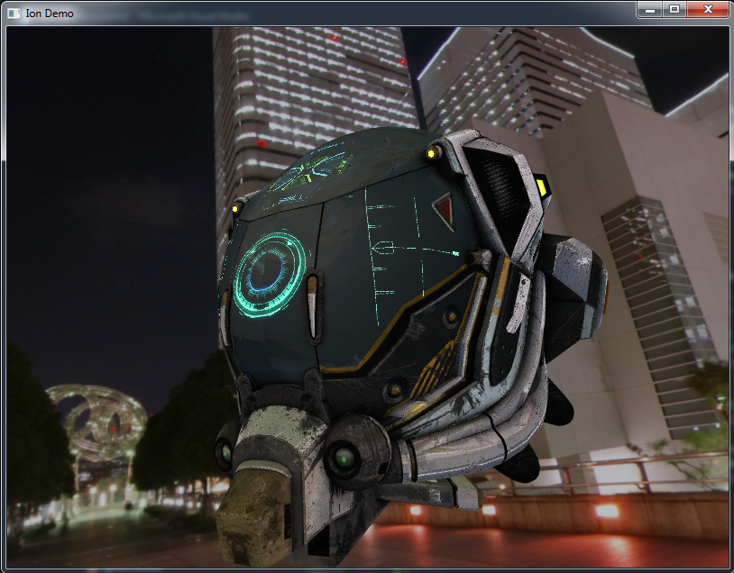

# Ion

Ion is a Vulkan Render Engine, made just to learn something about this new graphic API.
I'm not a render or engine programmer and this work MUST NOT BE USED for any commercial purpose.

> Ion in the Greek Mythology is the illegitimate child of Creüsa, daughter of Erechtheus and wife of Xuthus

## Status

**[X64] WORKING**

I'm not planning to do a x86 version

This is a screenshot about a first test on PBR render, maybe I need a more "brighty" and "shiny" skybox to generate maps from and set some different material parameters.

## Important

As I wrote before, this is made to learn something about this API.
Most of the code has been studied and inspired by:
- Dustin Land (https://www.fasterthan.life/) 
	- GitHub: https://github.com/DustinHLand
		- Buffers, caches and the initialization and setup of Vulkan and rendering backend core loop
- Sascha Willems (https://www.saschawillems.de/)
	- GitHub: https://github.com/SaschaWillems
		- Shaders and rendering tecnniques

## LICENSE

- Sources:
	- **ION**, the main project, is under GPL-3.0
	- **Eos**, **Nix** and **vkMemoryAllocator** are under Apache-2.0
	- **json.hpp** is under MIT License
	- **stb_image.h** is under MIT License OR Public Domain
	- **stb_image_write.h** is under MIT License OR Public Domain
	- **tiny_gltf.h** is under MIT License

- Assets:
	- **Yokohama3** is under Creative Commons Attribution 3.0 Unported License http://creativecommons.org/licenses/by/3.0/
	- **Damaged Helmet** is under a Creative Commons Attribution-NonCommercial license: https://github.com/KhronosGroup/glTF-Sample-Models/tree/master/2.0/DamagedHelmet

### Almost self inclusive

I tried to reduce external dependencies to the minimum.
All the dependencies are inside DEPENDENCIES folder.
The main dependencies at the moment are the memory allocators for CPU and GPU, made by me (Eos and vkMemoryAllocator)
Other dependencies are single file, like json and stb_image

### About dependencies

About how to use the dependencies please take a look to their own owner. (also for the mine!)

## Example

In the Demo folder you will find a demo project using ION Library

# Build Status

| Platform | Build Status |
|:--------:|:------------:|
| Windows (Visual Studio 2015) |  |
