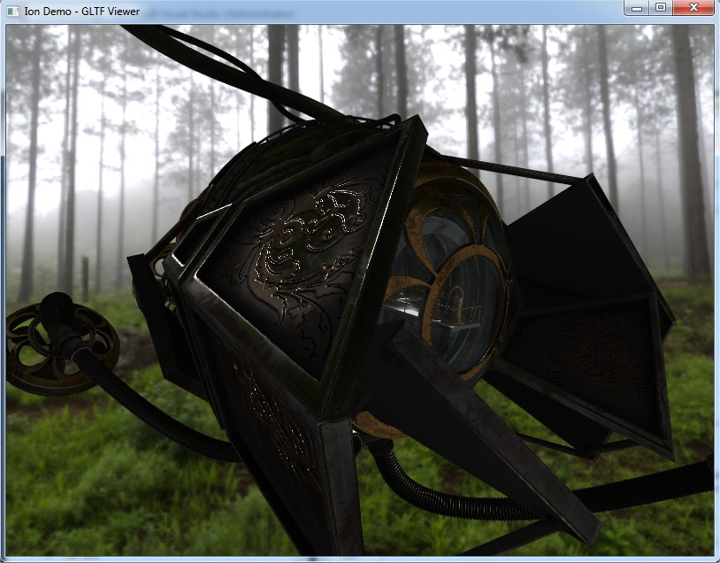

# Ion

Ion is a Vulkan Render Engine, made just to learn something about this new graphic API.
I'm not a render or engine programmer and this work SHOULD NOT BE USED for any commercial purpose.

> Ion in the Greek Mythology is the illegitimate child of Creüsa, daughter of Erechtheus and wife of Xuthus

## Important about Memory

I used my own allocator in this project and it has some specification to follow.
One of the main point of my allocator is having under control the memory footprint, so you have to define the size.
In the [MemorySettings.h](https://github.com/KabalMcBlade/Ion/blob/master/Ion/Core/MemorySettings.h) file you will find a list of the allocator used (defined by their size).
Anyway I did not set the "correct" size, is just depending by the project, so for me so far is ok, but you may want decrease or increase.
Sometimes some models will let Ion crash for memory, this is just because there is not enough memory for such allocator, so you have to track down the allocator and increase the memory.
This is simple, follows the below steps:
1. It will crash at this point

2. But you know is not a real crash, just check the console

3. So using callstack go down until you find something that looks like an array or any containers which resemble give the issue

4. Go to the declaration of that variable and you will see the allocator used

5. Go to the allocator and to the GetAllocator function associated to it

6. Go to the static value which define the size and you will see the size (Test on purpose I have set 1)

7. Resize it and run it again (if you want to be sure, set a huge size, or simple test different)

8. Done!

It takes sometimes because it needs to recompile all, in a future implementation would just be a config file which is read at the beginning and fill such values, avoiding compile time.

## Status

**[X64] WORKING**

I'm not planning to do a x86 version

This is a screenshot about a first test on PBR render.

If there is any lights accordingly with the materials loaded, the DEMO let you enable the direction lights debug in order to debug the lights pressing the key **L** (see below the control section)
Actually is a simple arrow in the top left that indicate (more or less) the orientation of the light, that could be useful when you go in the rotating light directional light mode pressing **L** key.
I did in this way to show you the capabilities to have another camera which render on top of another with another canvas, in fact is not a object rendered at the location but it is another render camera.

Using the DamagedHelmet supplied with this demo (for the license raed the end of this file)

Another PBR test (model NOT supplied by this demo, but you can download from https://sketchfab.com, the name is steampunkExplorer.gltf)

## Demo Controls

The demo uses command line (or from VS command line argument under the property of the demo project) in order to render.
The demo in fact is a GLTF viewer at the moment, because I'm using it for render purpose only.

#### Command lines (ION General)

* -width
	* set the width size of the window
* -height
	* set the height size of the window
* -fullscreen
	* set fullscreen (true or false)
* -showcursor
	* show mouse cursor (true or false)

For instance:	-width 1024 -height 768 -fullscreen true

#### Command lines (Demo)

* -model
	* load a model, if -usepath IS NOT DEFINED, the model MUST be only the filename and MUST be inside the Assets/Models demo folder
* -primitive
	* load primitives (quad, triangle, cube, sphere, pyramid)
* -usepath
	* if -usepath is set, you need to specified the fullpath of the model file and can be everywhere 
* -dumpgltf
	* will dump the gltf model loaded in the ION structure nodes into json file, following different level of detail (0: just nodes and transform; 1: nodes, transform and animations if any; 2; everything, even vertex, which is very expensive and will generate huge file)

For instance:	
* -primitive cube
* -model DamagedHelmet.gltf
* -usepath -model "C:\Users\MyUser\Downloads\DamagedHelmet\DamagedHelmet.gltf"
* -dumpgltf 1 -model DamagedHelmet

#### Controls

The controls in this demo test are:

* Hold **left mouse button** in order to rotate the object
* Hold **right mouse button** in order to pan right or left and up or down the object
* Use the **mouse wheel** to go toward or far away the object
* Press **R** to auto rotate the model
* Hold key **J** increase x 10 the wheel speed of the mouse and **K** to increase x 100
* Press **I** will decrease the scale by 10, press **O** will increase the scale by 10
* Press **Return** key (**Enter** key) to reset the model transform

Pressing the key **L**, you can change the control from the model to the light
In this case, toggling the **L** key you will have:
* Move the mouse without press any button in order to rotate the light

To Debug PBR
* Press **E**, **G** or **P** to change the active value between esposure, gamma or prefiltered cube mip levels
* Press **Page Up** or **Page Down** to increment or decrement the selected values

Animations: (NOTE: for now supported only animation, not morph/target or skinning)
* Press **Up arrow** or **Down arrow** to change animation to play (if any)
* Press **Right arrow** or **Left arror** to increment or decrement the speed of the animation

## Note on control and on model loaded
This demo is a simple imported in the way that it is loading he GLTF format file.
THere are some error and sometimes it does not look right (most of the case work).
Another important point there is no adjustment about axis or about center, scale or other; so it can happens many time to have different center and the camera work differently model by model

## Important

As I wrote before, this is made to learn something about this API.
I got my inspiration from the following persons and their code
- Dustin Land (https://www.fasterthan.life/) 
	- GitHub: https://github.com/DustinHLand
- Sascha Willems (https://www.saschawillems.de/)
	- GitHub: https://github.com/SaschaWillems

## LICENSE

- Sources:
	- **ION**, the main project, is under GPL-3.0
	- **Eos** and **Nix** are under Apache-2.0
	- **json.hpp** is under MIT License
	- **stb_image.h** is under MIT License OR Public Domain
	- **stb_image_write.h** is under MIT License OR Public Domain
	- **tiny_gltf.h** is under MIT License

- Assets:
	- **misty_pines_4k.hdr** is under CC0 license (https://creativecommons.org/publicdomain/zero/1.0/) and was downloaded from here https://hdrihaven.com/hdri/?c=morning-afternoon&h=misty_pines
	- **Yokohama3** is under Creative Commons Attribution 3.0 Unported License http://creativecommons.org/licenses/by/3.0/
	- **Damaged Helmet** is under a Creative Commons Attribution-NonCommercial license: https://github.com/KhronosGroup/glTF-Sample-Models/tree/master/2.0/DamagedHelmet

### Almost self inclusive

I tried to reduce external dependencies to the minimum.
All the dependencies are inside DEPENDENCIES folder.
The main dependencies at the moment are the memory allocators for CPU and GPU, made by me (Nix and Eos)
Other dependencies are single file, like json and stb_image

### About dependencies

About how to use the dependencies please take a look to their own owner. (also for the mine!)

# Build Status

| Platform | Build Status |
|:--------:|:------------:|
| Windows (Visual Studio 2017) |  |
